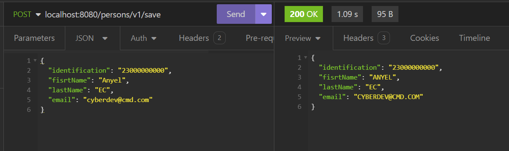
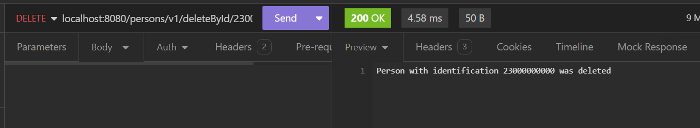

# **Select Language:** 🌍 
- [Español (Spanish)](README-es.md)
- [English](README.md)

# NCAPAS - Multi-layer CRUD Application with Spring Boot

## Descripción
NCAPAS es una aplicación Spring Boot diseñada para gestionar operaciones CRUD (Crear, Leer, Actualizar y Eliminar) en una lista de personas. La aplicación utiliza una arquitectura en capas para separar las responsabilidades y mejorar la mantenibilidad y escalabilidad del código. Además, implementa servicios que transforman los datos a mayúsculas antes de almacenarlos.

## RESULTS
### Swagger UI Documentation

### Create a new person

### Read all persons

### Swagger UI Documentation



## Estructura del Proyecto
El proyecto se organiza en las siguientes capas:

- **Controller**: Maneja las solicitudes HTTP y devuelve respuestas apropiadas.
- **Service**: Contiene la lógica de negocio.
- **Repository**: Interactúa con los datos almacenados (en este caso, una lista en memoria).
- **Model**: Define las entidades de datos.
- **Utils**: Proporciona utilidades auxiliares.

## Dependencias
Las principales dependencias usadas en este proyecto son:

- Spring Boot Starter Web
- Spring Boot DevTools
- Lombok
- Spring Boot Starter Test
- SpringDoc OpenAPI

## Configuración de Swagger
Swagger se utiliza para documentar y probar la API. La documentación está disponible en `http://localhost:8080/persons/v1/swagger-ui.html`.

## Cómo Ejecutar el Proyecto
1. Clona el repositorio.
2. Navega al directorio del proyecto.
3. Ejecuta `mvn spring-boot:run`.

## API Endpoints
### GET /
Devuelve un mensaje de bienvenida y la URL para acceder a la documentación de Swagger.

### POST /persons/v1/save
Guarda una nueva persona.
- **Request Body**: JSON con los datos de la persona.
- **Response**: La persona guardada con los datos en mayúsculas.

### GET /persons/v1/findAll
Devuelve una lista de todas las personas guardadas.

### GET /persons/v1/findById/{identification}
Devuelve una persona por su identificación.
- **Path Variable**: `identification` (String).

### PUT /persons/v1/updateById/{identification}
Actualiza una persona existente por su identificación.
- **Path Variable**: `identification` (String).
- **Request Body**: JSON con los datos actualizados de la persona.
- **Response**: La persona actualizada con los datos en mayúsculas.

### DELETE /persons/v1/deleteById/{identification}
Elimina una persona por su identificación.
- **Path Variable**: `identification` (String).
- **Response**: Mensaje indicando si la persona fue eliminada o no encontrada.

## Código de Ejemplo
### Controlador

```java
@RestController
@RequestMapping("/persons/v1")
public class PersonController {
    @Autowired
    private PersonService personService;

    @GetMapping("/")
    public String index(){
        return "In /persons/v1/swagger-ui.html you can see the documentation of the API";
    }

    @PostMapping("/save")
    public Person save(@RequestBody Person person) {
        return personService.save(PersonUpperCaseService.toUpperCase(person));
    }

    @GetMapping("/findAll")
    public List<Person> findAll(){
        return personService.findAll();
    }

    @GetMapping("/findById/{identification}")
    public Person findById(@PathVariable String identification){
        return personService.findById(identification);
    }

    @PutMapping("/updateById/{identification}")
    public Person updateById(@PathVariable String identification, @RequestBody Person person){
        return personService.updateById(identification, PersonUpperCaseService.toUpperCase(person));
    }

    @DeleteMapping("/deleteById/{identification}")
    public String deleteById(@PathVariable String identification){
        return personService.deleteById(identification);
    }
}
```

### Servicio

```java
@Service
public class PersonService {

    @Autowired
    private PersonRepository personRepository;

    public Person save(Person person){
        return personRepository.save(person);
    }

    public List<Person> findAll(){
        return personRepository.findAll();
    }

    public Person findById(String identification){
        return personRepository.findById(identification);
    }

    public Person updateById(String identification, Person person){
        return personRepository.updateById(identification, person);
    }

    public String deleteById(String identification){
        return personRepository.deleteById(identification);
    }
}
```

### Repositorio

```java
@Repository
public class PersonRepository {

    List<Person> persons = new ArrayList<>();

    public Person save(Person person){
        persons.add(person);
        return person;
    }

    public List<Person> findAll(){
        return persons;
    }

    public Person findById(String identification){
        for (Person person : persons) {
            if (person.identification().equals(identification)) {
                return person;
            }
        }
        return null;
    }

    public Person updateById(String identification, Person person){
        for (int i = 0; i < persons.size(); i++) {
            if (persons.get(i).identification().equals(identification)) {
                persons.set(i, person);
                return person;
            }
        }
        return null;
    }

    public String deleteById(String identification){
        for (int i = 0; i < persons.size(); i++) {
            if (persons.get(i).identification().equals(identification)) {
                persons.remove(i);
                return "Person with identification " + identification + " was deleted";
            }
        }
        return "Person with identification " + identification + " was not found";
    }
}
```

### Utilidad para Mayúsculas

```java
public class PersonUpperCaseService {

    private static UpperCaseImpl helper = new UpperCaseImpl();

    public static Person toUpperCase(Person person) {
        String upperIdentification = helper.upperCase(person.identification());
        String upperFirstName = helper.upperCase(person.fisrtName());
        String upperLastName = helper.upperCase(person.lastName());
        String upperEmails = helper.upperCase(person.email());
        return new Person(upperIdentification, upperFirstName, upperLastName, upperEmails);
    }
}
```

### Archivo de Configuración application.properties

```properties
spring.application.name=NCAPAS
springdoc.api-docs.enabled=true
springdoc.swagger-ui.enabled=true
springdoc.swagger-ui.path=/swagger-ui.html
```

### POM.xml

```xml
<project xmlns="http://maven.apache.org/POM/4.0.0" xmlns:xsi="http://www.w3.org/2001/XMLSchema-instance"
         xsi:schemaLocation="http://maven.apache.org/POM/4.0.0 https://maven.apache.org/xsd/maven-4.0.0.xsd">
    <modelVersion>4.0.0</modelVersion>
    <parent>
        <groupId>org.springframework.boot</groupId>
        <artifactId>spring-boot-starter-parent</artifactId>
        <version>3.2.5</version>
        <relativePath/>
    </parent>
    <groupId>top.anyel</groupId>
    <artifactId>NCAPAS</artifactId>
    <version>0.0.1-SNAPSHOT</version>
    <name>NCAPAS</name>
    <description>NCAPAS</description>
    <properties>
        <java.version>17</java.version>
    </properties>
    <dependencies>
        <dependency>
            <groupId>org.springframework.boot</groupId>
            <artifactId>spring-boot-starter-web</artifactId>
        </dependency>
        <dependency>
            <groupId>org.springframework.boot</groupId>
            <artifactId>spring-boot-devtools</artifactId>
            <scope>runtime</scope>
            <optional>true</optional>
        </dependency>
        <dependency>
            <groupId>org.projectlombok</groupId>
            <artifactId>lombok</artifactId>
            <optional>true</optional>
        </dependency>
        <dependency>
            <groupId>org.springframework.boot</groupId>
            <artifactId>spring-boot-starter-test</artifactId>
            <scope>test</scope>
        </dependency>
        <dependency>
            <groupId>org.springdoc</groupId>
            <artifactId>springdoc-openapi-starter-webmvc-ui</artifactId>
            <version>2.5.0</version>
        </dependency>
    </dependencies>
    <build>
        <plugins>
            <plugin>
                <groupId>org.springframework.boot</groupId>
                <artifactId>spring-boot-maven-plugin</artifactId>
                <configuration>
                    <excludes>
                        <exclude>
                            <groupId>org.projectlombok</groupId>
                            <artifactId>lombok</artifactId>
                        </exclude>
                    </excludes>
                </configuration>
            </plugin>
        </plugins>
    </build>
</project>
```

## Contribución
Si deseas contribuir a este proyecto, por favor sigue los siguientes pasos:
1. Haz un fork del repositorio.
2. Crea una nueva rama (`git checkout -b feature-nueva`).
3. Realiza tus cambios y haz commit (`git commit -am 'Añadir nueva característica'`).
4. Haz push a la rama (`git push origin feature-nueva`).
5. Crea un nuevo Pull Request.

## Licencia
Este proyecto está bajo la Licencia MIT.